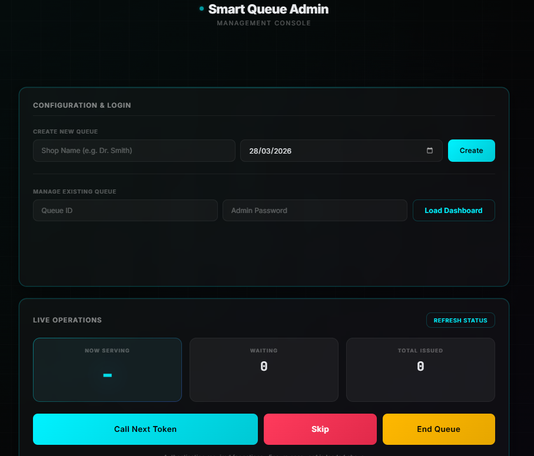
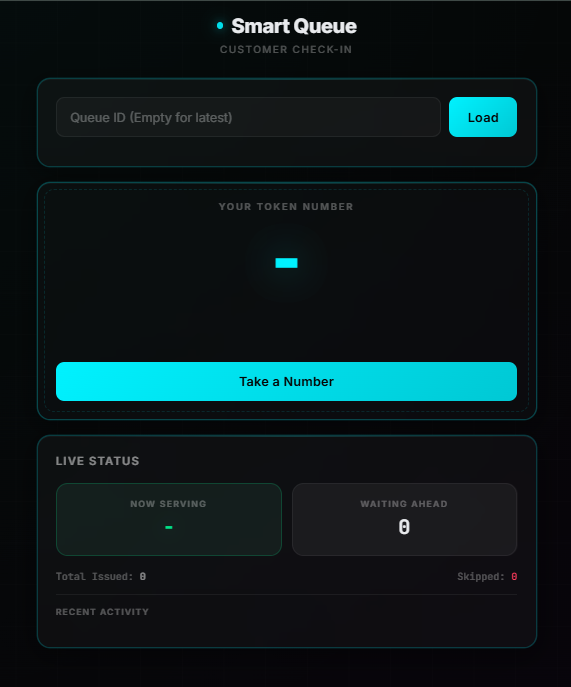

**SMART QUEUE MANAGER**

*ADMIN*


*CUSTOMER*


# Smart Queue Manager — Local dev

This repository contains a simple demo app: an Express + MongoDB backend and a tiny static frontend.

Quick overview
- backend/: Express API (runs on port 4000 by default)
- frontend/: Static UI (index.html and admin.html)

Prerequisites
- Node.js (14+ or current LTS)
- npm
- MongoDB running locally or remote (the backend defaults to mongodb://127.0.0.1:27017/sqms)

Run locally (recommended)

1) Install backend deps

```powershell
cd backend
npm install
```

2) (Optional) install root dev deps to run both servers together

```powershell
cd ..
npm install
```

3) Start backend only

```powershell
# from backend/
node server.js
# or for auto-restart during development
npm run dev
```

4) Serve frontend (one of these)

Option A (recommended): lightweight static server

```powershell
cd frontend
npx http-server -p 8080
# then open http://localhost:8080/index.html and http://localhost:8080/admin.html
```

Option B: open the HTML files directly in your browser (works for demo but serving is smoother).

Run both (one command) — dev convenience

After running `npm install` at repo root, you can run:

```powershell
npm run dev
```

This uses `concurrently` to start the backend and frontend servers.

Demo — example API requests (PowerShell)

```powershell
# create a queue (admin). Replace password if you changed it in backend/.env
$headers = @{ Authorization = 'Bearer admin123'; 'Content-Type' = 'application/json' }
$body = @{ shopName = 'Demo Shop'; date = (Get-Date -Format yyyy-MM-dd) } | ConvertTo-Json
Invoke-RestMethod -Uri http://localhost:4000/api/queues -Method Post -Headers $headers -Body $body

# request a token (customer)
Invoke-RestMethod -Uri "http://localhost:4000/api/queues/<QUEUE_ID>/token" -Method Post

# call next (admin)
Invoke-RestMethod -Uri "http://localhost:4000/api/queues/<QUEUE_ID>/next" -Method Post -Headers $headers
```
What is persisted between runs
- The app uses MongoDB for data storage. All created queues/tokens are stored in the MongoDB database configured by `backend/.env` (MONGODB_URI). As long as the MongoDB data directory is preserved, your data (created queues, tokens, etc.) will be available on the next run.
- The demo helper saves a small state file at `./.demo/demo_state.json` which contains the last created queue id and sample token info for convenience.

